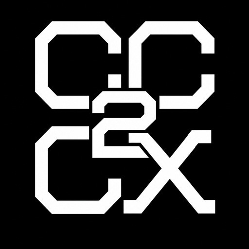
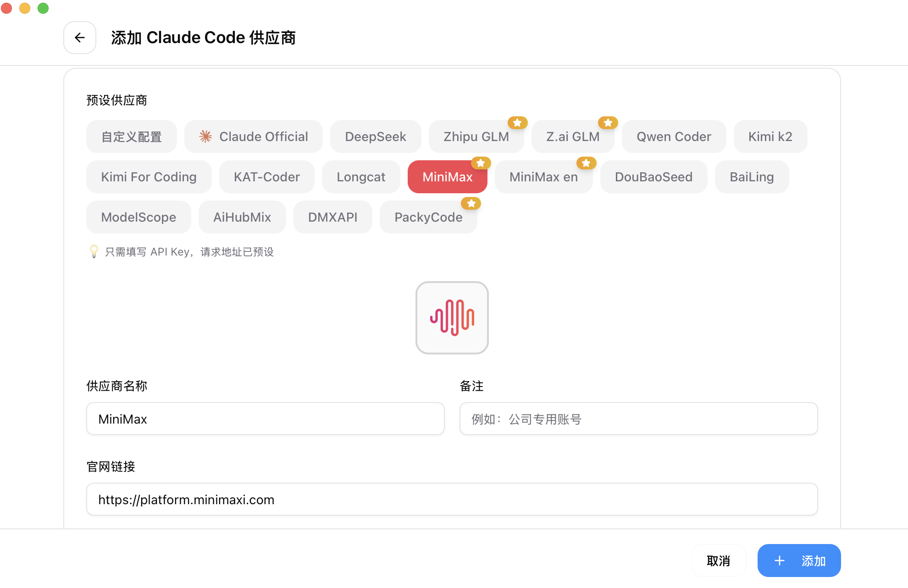

# cc2cx

<p align="center">
  
</p>

<p align="center"><strong>跨平台 AI 编程 Agent 管理器</strong></p>

<p align="center">
  一键检查、安装和维护 Codex、Claude Code、OpenCode、WorkBuddy 等工具，统一管理供应商、MCP、Skills、提示词和会话。
</p>

<p align="center">
  <a href="https://github.com/aikenchen0-ctrl/cc2cx">项目主页</a>
  ·
  <a href="https://github.com/aikenchen0-ctrl/cc2cx/releases">下载发布包</a>
  ·
  <a href="https://github.com/aikenchen0-ctrl/cc2cx/issues">问题反馈</a>
</p>

## 项目定位

`cc2cx` 是一个基于 Tauri 2 的桌面应用，目标是在 Windows 和 macOS 上降低 AI 编程工具的安装、配置和切换成本。

首次启动时，应用会自动扫描本机环境并进入 Agent 安装页面。用户可以看到每个工具的安装状态、版本、依赖和可执行性，再按需单独安装或批量安装。

## Agent 支持

### 一键安装

| Agent       | 类型         | 平台                  | 说明                                                                 |
| ----------- | ------------ | --------------------- | -------------------------------------------------------------------- |
| Codex UI    | 桌面应用     | Windows、macOS        | Windows 使用 Microsoft Store 包；macOS 使用官方 ChatGPT/Codex 安装包 |
| Codex CLI   | 命令行 Agent | Windows、macOS、Linux | 通过 npm 安装，自动检查 Node.js 和 npm                               |
| Claude Code | 命令行 Agent | Windows、macOS、Linux | 通过 npm 安装；Windows 额外检查 Git Bash 或 WSL                      |
| OpenCode    | 命令行 Agent | Windows、macOS、Linux | 通过 npm 安装；Windows 将 WSL 标记为推荐环境                         |
| WorkBuddy   | 桌面 Agent   | Windows、macOS        | 从腾讯官方更新接口获取安装包并校验                                   |

### 其他受管工具

应用还可以检测和管理 Gemini CLI、Grok Build、OpenClaw、Hermes、Pi 等工具。Claude Desktop 支持状态识别，但安装仍需使用 Anthropic 官方安装器。

## 核心能力

- 首次启动自动扫描 Agent，并在发现缺失项时打开安装引导页面。
- 自动准备 Node.js：Codex CLI、Claude Code、OpenCode 缺少 Node.js 18+ 或 npm 时，会先安装 Node.js，再继续安装 Agent。
- 安装过程显示阶段、实时输出和进度，安装结束后自动重新检测。
- npm 安装失败时按顺序回退到 npm 官方源、npmmirror 和华为云 npm 仓库。
- Node.js 便携版下载使用华为云镜像，并校验 `SHASUMS256.txt`，不会覆盖系统 Node.js。
- WorkBuddy 使用腾讯官方更新接口；Windows 下载包缺少 SHA-256 时，改用 Authenticode 签名校验，发行方必须为 Tencent。
- 管理多套供应商配置、API 地址、模型目录和客户端应用切换。
- 管理 MCP 服务器、Skills、Prompt 和模板，并同步到受支持的 Agent。
- 提供本地路由、故障转移、会话浏览、用量统计、价格配置和系统日志。
- 在“设置 → 代理 → 全局代理”中，可将 HTTP 或 SOCKS5 代理安全同步到 Codex 的 `.env`。
- 支持配置目录覆写、SQLite 数据备份、恢复、导入和导出。
- 支持托盘驻留和应用自动更新。

## 使用流程

1. 安装并启动 `cc2cx`。
2. 在自动打开的 Agent 页面查看本机环境和缺失项。
3. 选择单个 Agent 安装，或点击批量安装；Node.js 会在需要时自动准备。
4. 安装完成后重新扫描，确认工具状态为可用。
5. 在供应商页面添加 API 地址、密钥和模型配置。
6. 在 MCP、Skills、Prompt 页面按需同步配置。
7. 如修改了命令行工具的配置，重新打开对应终端或 Agent。

## 界面预览




## 安装与下载

正式安装包会发布在 [GitHub Releases](https://github.com/aikenchen0-ctrl/cc2cx/releases)。请根据系统和架构选择对应产物：

| 系统    | 推荐产物                      | 安装方式                            |
| ------- | ----------------------------- | ----------------------------------- |
| Windows | `.msi` 或 `.exe`              | 双击运行安装器                      |
| macOS   | `.dmg`                        | 打开镜像，将应用拖入“应用程序”      |
| Linux   | `.AppImage`、`.deb` 或 `.rpm` | 按发行版方式安装或直接运行 AppImage |

正式发布包应经过平台签名。未签名构建适合本地测试和内部使用，Windows 可能显示 SmartScreen 提示，macOS 可能需要在“系统设置 → 隐私与安全性”中允许打开。

## 数据目录

默认应用数据目录为：

```text
~/.cc-launch/
```

主要数据库文件为：

```text
~/.cc-launch/cc-launch.db
```

可以在应用设置中修改配置目录。应用不会自动迁移旧版 `cc-switch` 数据；如需迁移，请先备份原数据，再通过导入功能人工确认。

## 开发环境

- Node.js 20 或更高版本
- Corepack 与 pnpm 10.12.3
- Rust 1.85 或更高版本
- Windows 需要 Visual Studio C++ 工具链
- macOS 需要 Xcode Command Line Tools
- 各平台对应的 [Tauri 前置依赖](https://v2.tauri.app/start/prerequisites/)

Rust 工具链由 [rust-toolchain.toml](rust-toolchain.toml) 固定。Tauri 前端和 Rust 依赖已锁定到经过验证的版本组合，安装时请使用锁文件。

## 本地运行

```bash
corepack enable
corepack pnpm@10.12.3 install --frozen-lockfile
corepack pnpm@10.12.3 dev
```

开发模式会启动 Vite 和 Tauri 桌面窗口，前端开发地址为 `http://localhost:3000/`。该地址仅用于开发，不会被写入生产安装包。

## 检查与测试

```bash
# 类型检查
corepack pnpm@10.12.3 typecheck

# 前端单元测试
corepack pnpm@10.12.3 test:unit

# 格式检查
corepack pnpm@10.12.3 format:check

# Rust 检查和测试
cargo check --manifest-path src-tauri/Cargo.toml
cargo test --manifest-path src-tauri/Cargo.toml
```

## 构建安装包

请在目标操作系统上构建对应平台的原生安装包。Windows、macOS 和 Linux 的桌面运行时、签名工具和系统依赖不同，不能依赖另一种操作系统完成可靠的跨平台桌面打包。

### Windows

本地测试可构建未签名 NSIS 安装包：

```powershell
$env:CI = "true"
corepack pnpm@10.12.3 tauri build --bundles nsis --no-sign
```

构建未签名 MSI：

```powershell
corepack pnpm@10.12.3 tauri build --bundles msi --config src-tauri/tauri.unsigned.conf.json
```

也可以双击项目根目录的 `build-pack.cmd`。

### macOS

```bash
corepack pnpm@10.12.3 tauri build --target universal-apple-darwin
```

正式分发前需要配置 Apple Developer ID 签名和公证。详细的系统依赖、架构、签名和产物说明见 [产物构建.md](产物构建.md)。

## 自动更新签名

项目配置了 Tauri Updater。正式生成更新产物时，需要在本机或 CI 中提供私钥环境变量：

```text
TAURI_SIGNING_PRIVATE_KEY
TAURI_SIGNING_PRIVATE_KEY_PASSWORD
```

私钥不得提交到 Git 仓库。仅用于本地测试时，可以使用 `--no-sign` 跳过更新签名；这不适合作为正式发布方式。

## 项目结构

```text
src/                    React + TypeScript 前端
src-tauri/              Tauri + Rust 后端、原生打包配置和测试
integrations/cc-boot/   Agent 安装和命令行集成
assets/screenshots/     README 和文档截图
flatpak/                Linux Flatpak 打包文件
docs/                   设计说明、用户手册和构建文档
```

## 贡献与安全

- 贡献说明：[CONTRIBUTING.md](CONTRIBUTING.md)
- 安全问题报告：[SECURITY.md](SECURITY.md)
- 使用支持：[SUPPORT.md](SUPPORT.md)
- 问题与建议：[GitHub Issues](https://github.com/aikenchen0-ctrl/cc2cx/issues)

请不要在 Issue、日志或截图中公开 API Key、OAuth Token、Updater 私钥或其他敏感配置。

## 许可证

[MIT](LICENSE)
